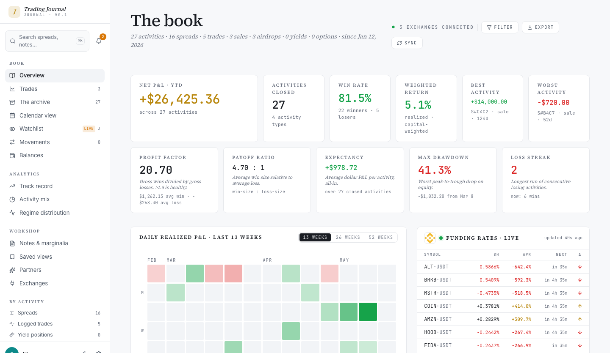

# Journal

A local-first crypto trading journal that models spreads, trades, sales, and airdrops as first-class activities. Self-hosted, exchange-aware, never sells your data.



> Status: alpha (pre-v1). The schema is stable enough to journal against, but breaking changes can still ship. Keep backups.

---

## Download & install

Journal is a normal desktop app. You download one file, install it, and double-click to run it — there is **nothing else to set up**. No database to install, no command line, no account to create. The app carries its own database inside it and keeps everything on your computer.

### Step 1 — Download the right file

| Your computer | Download |
|---|---|
| **Mac with Apple chip** (M1, M2, M3, M4 — most Macs since 2020) | [**Journal for Apple Silicon**](https://github.com/DiamondDime/trading-journal/releases/latest/download/Journal-mac-arm64.dmg) |
| **Mac with Intel chip** (older Macs) | [**Journal for Intel Mac**](https://github.com/DiamondDime/trading-journal/releases/latest/download/Journal-mac-x64.dmg) |
| **Windows** (10 or 11, 64-bit) | [**Journal for Windows**](https://github.com/DiamondDime/trading-journal/releases/latest/download/Journal-win-x64.exe) |

Or browse every version on the **[Releases page](https://github.com/DiamondDime/trading-journal/releases/latest)**.

**Not sure which Mac you have?** Click the  Apple menu (top-left of the screen) → **About This Mac**. If it says *Chip: Apple M…*, pick Apple Silicon. If it says *Processor: Intel…*, pick Intel.

### Step 2 — Install it

Journal is not distributed through the App Store and is not signed with a paid Apple/Microsoft certificate, so your operating system shows a one-time caution prompt the first time you open it. **This is expected.** Here is how to get past it.

#### On macOS

1. Open the downloaded `.dmg` file (double-click it).
2. In the window that appears, **drag the `Journal` icon onto the `Applications` folder**.
3. Open your **Applications** folder and double-click **Journal**.
4. macOS will say it *can't verify the app is free of malware*. Click **Done** (don't move it to Trash).
5. Open the  Apple menu → **System Settings** → **Privacy & Security**.
6. Scroll down to the **Security** section. You'll see a line: *"Journal" was blocked to protect your Mac.* Click **Open Anyway**.
7. Confirm with Touch ID or your password. Journal opens. You won't see this prompt again.

#### On Windows

1. Double-click the downloaded `Journal-win-x64.exe`.
2. Windows SmartScreen may say *"Windows protected your PC."* Click **More info**, then **Run anyway**.
3. The installer runs and creates a **Journal** shortcut in your Start menu and on your desktop.
4. Launch Journal from the Start menu.

> **Why the warnings?** They appear for any app not signed with an expensive vendor certificate — they are not a sign that anything is wrong. Journal sends no telemetry and makes no network calls except to the exchanges you explicitly connect. See [Privacy](#privacy) below.

### Step 3 — First launch

The first time Journal opens it sets up its private database on your computer. This takes a few seconds — the window may look empty or briefly show a loading state. That's normal and only happens once.

There is **no sign-up and no login**. Journal is single-user by design: the app is yours and the data never leaves your machine.

When the dashboard appears, you can start right away:

- **Add an activity manually** — click **+ Add** in the top bar and choose a spread, trade, sale, airdrop, yield position, option, or movement.
- **Import a CSV** — go to **Settings → Import** to load trade history exported from an exchange.
- **Connect an exchange** — go to **Settings → Exchanges**. (Automatic exchange sync is currently available in the self-hosted web version; the desktop sync engine is in progress — see [Limitations](#current-limitations).)

---

## Updating

Journal checks for new versions automatically. When an update is available it downloads quietly in the background and installs the next time you restart the app. You never have to re-download manually.

---

## Where your data lives

Everything — your journal, notes, screenshots, and the database itself — is stored in one folder on your computer:

| OS | Folder |
|---|---|
| macOS | `~/Library/Application Support/crypto-journal/` |
| Windows | `%APPDATA%\crypto-journal\` (i.e. `C:\Users\<you>\AppData\Roaming\crypto-journal\`) |

To **back up** Journal, copy that folder somewhere safe. To **move** Journal to a new computer, install the app there and copy the folder across. To **start fresh**, quit Journal and delete the folder — the app rebuilds it on next launch.

---

## What it does

- **Seven activity types, modelled separately.** Spreads (multi-leg, multi-venue strategies), Trades (single-venue positions), Sales (IDO / launchpad / premarket / OTC allocations with vesting and claims), Airdrops, Yield positions, Options, and Movement events.
- **Exchange ingestion** for 11 venues — CCXT-backed for Binance, Bybit, OKX, BingX, Gate, MEXC, KuCoin, Bitget, HTX, Phemex; bespoke for Hyperliquid. API keys with withdraw permission are rejected at connection time.
- **Leg matcher** — heuristic proposals that link two trades on the same asset across exchanges into a single spread. You accept or reject each candidate.
- **APR-first analytics** — P&L series, breakdown by exchange / asset / regime, funding attribution, MAE/MFE excursions, drawdown, win/loss streaks, Sharpe and Sortino.
- **Editorial journal** — one Markdown note per activity, annotated screenshot attachments, controlled-vocabulary tags, saved views.
- **English and Russian** interface, switched with one click.

The full feature list and roadmap live in `docs/specs/`.

---

## Current limitations

Journal is pre-v1 alpha. Honest status:

- **Desktop exchange sync is not shipped yet.** The desktop app currently supports manual entry and CSV import. Automatic fill ingestion from connected exchanges works in the self-hosted web version; the desktop sync engine is in active development.
- **The app is not notarized.** Hence the one-time security prompt during install (see Step 2). It is otherwise a normal, safe desktop application.
- **Migrations may break.** Keep a backup of your data folder before installing a new version.

---

## Privacy

No telemetry. No analytics. No phone-home. Your data stays on your machine.

Exchange API keys are encrypted with **AES-256-GCM** before they are ever stored. The encryption key lives in your OS keychain, never in the database. Plaintext credentials never appear in API responses, never get written to logs, and never leave the request handler in clear form. Adapters reject any API key that grants withdraw permission. See [SECURITY.md](SECURITY.md) for the full threat model.

---

## For developers

Building from source, running the web version, and the desktop architecture:

### Run the web version

Requires Node 22, Postgres 16, and pnpm.

```bash
git clone https://github.com/DiamondDime/trading-journal
cd trading-journal
pnpm install
cp .env.example .env          # set DATABASE_URL, CREDENTIALS_MASTER_KEY, APP_USER_ID
pnpm db:create && pnpm db:migrate
pnpm db:seed                  # optional: 27 demo activities
pnpm dev                      # http://localhost:3000
```

### Build the desktop app

```bash
pnpm electron:build           # produces dist-electron/Journal-mac-*.dmg
pnpm electron:build:win       # produces the Windows installer (run on Windows)
```

The desktop app wraps the same Next.js server in Electron and swaps Postgres for in-process [PGlite](https://pglite.dev) — the codebase's `postgres.js`-style queries run through a thin compatibility shim (`src/lib/db/pglite-shim.ts`). See [ELECTRON.md](ELECTRON.md) for the desktop architecture and [ARCHITECTURE.md](ARCHITECTURE.md) for the system overview.

### Cut a release

Pushing a `v*.*.*` tag triggers `.github/workflows/release-desktop.yml`, which builds the macOS DMGs and the Windows installer on GitHub's runners and publishes them to a GitHub Release. The download links at the top of this file always point at the newest release. Code-signing and notarization are documented in [electron/CODESIGNING.md](electron/CODESIGNING.md).

---

## License

[AGPL-3.0](LICENSE). If you run a modified copy on a network-reachable server, you must offer the modified source to its users — see section 13 of the license.

## Contributing

See [CONTRIBUTING.md](CONTRIBUTING.md). Bug reports and feature requests use the templates under [`.github/ISSUE_TEMPLATE/`](.github/ISSUE_TEMPLATE/). Adapter requests are welcome.
